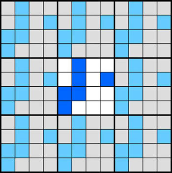

# A brief description of the "Game of Life" problem

The "Game of Life," is a simple simulation developed by John Conway. In the "Game of Life" the domain is a 2-dimensional array of cells, and each cell can have one of two possible states, usually referred to as "alive" or "dead." The array is usually intialized using random numbers and the system then evolves in time. At each time step, each cell may or may not change its state, based on the number of adjacent alive cells, including diagonals. There are three rules:

1. If a cell has three neighbors that are alive, the cell will be alive. If it was already alive, it will remain so, and if it was dead, it will become alive.
2. If a cell has two neighbors that are alive, there is no change to the cell. If it was dead, it will remain dead, and if it was alive, it will remain alive.
3. In all other cases — the cell will be dead. If it was alive it becomes dead and if it was dead it remains dead.

An example of the changes that occur for two cells in a given time step are shown in Figure 1 below where "live" cells are blue, and "dead" cells are white.

The idea behind the "Game of Life" is that it crudely simulates populations of organisms. The organisms need the support of other organisms to live. If there is not a significant population, i.e., zero or one neighbor, the organism will die. If there are two neighbors, the case is neutral, with no change. If there are three neighbors, the organisms will multiply. With four or more neighbors, there is overcrowding, and the organisms will die.

Since adjacent cells are required to determine the new state of each cell, some special considerations must be given to boundary conditions. For example, if we're looking at a cell on the far left side of the domain, we need to know the state of the cell to its left to determine its new state. The problem is that there is no cell to its left, since its on the edge of the domain. This problem is usually overcome by introducing a border of "ghost cells," and assuming periodic boundary conditions. The assumption is that the domain repeats to infinity in all directions. This is shown in the Figure 2.

In Figure 1, a 4x4 grid is shown for simplicity. The domain has been repeated, or "tiled," in every direction. The tiled domains are shown in gray and light blue to differentiate them from the actual domain. The ghost cells are represented by the border of cells from the tiled domain all around the actual domain. Looking at the leftmost column of the actual domain, the cells to the left of this column, from the left-hand tiled domain, are the same as the cells on the right-hand side of the actual domain. A similar configuration can be seen at the right, top, and bottom of the actual domain.

The periodicity works a bit differently at the corners. Take a look, for example, at the ghost cell just above and to the right of the actual domain. This cell clearly must be copied from the bottom left cell of the actual domain. This approach works similarly for the other corner ghost cells.

When writing the code, the ghost cells are defined around the border of the actual domain. At the beginning of each time step, the appropriate values (from the tiled cells) are copied to the appropriate ghost cells.

In an actual implementation of the "Game of Life," the array is rendered graphically, showing the state of each cell, typically by using two different colors. As the program runs, patterns are observed to occur, with sub-populations waxing and waning. It is even possible for the population to go extinct. In this course problem, you do not need to concern yourself with the graphical display of the results, but simply the generation of the states of the cells. Just so the code does something, and to have a way to validate that it is giving the same result for the serial and parallel cases, you will show the total number of live cells at the end of the time iterations.

