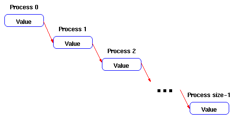
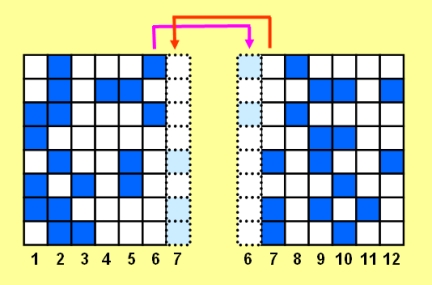

# Overview

In this lab, you will gain familiarity with MPI program structure, and point-to-point communication by working with venerable programs such as "Hello, World", calculation of &pi;, the game of life, and parallel search.

### Goals

Get familiar with MPI program structure, and point-to-point communication by writing a few simple MPI programs.

### Duration

Three hours


# Source Codes

- Hello, World: Serial C and Fortran ([hello_mpi.c](hello_mpi.c) and [hello_mpi.f90](hello_mpi.f90)) 
- Send data across all processes : No source provided
- Calculation of &pi;: Serial C and Fortran ([pi_serial.c](pi_serial.c) and [pi_serial.f90](pi_serial.f90))
- Parallel Search: Serial C and Fortran ([parallel_search-serial.c](parallel_search-serial.c) 
  and [parallel_search-serial.f90](parallel_search-serial.f90)),
  input file ([b.data](b.data)), and output file ([reference.found.data](reference.found.data))
- Game of Life: Serial C and Fortran ([game_of_life-serial.c](game_of_life-serial.c) and [game_of_life-serial.f90](game_of_life-serial.f90)) 

# Preparation

In preparation for this lab, read the [instructions on logging in to PDC](https://www.pdc.kth.se/support/documents/login/login.html), 
which will help you get going on Beskow.

# Exercise 1: Run "Hello, World"

[Compile](https://www.pdc.kth.se/support/documents/software_development/development.html) 
and run the "Hello, World" program found in the lecture. Make sure you understand how each processors prints its rank as well as the total number of processors in the communicator MPI_COMM_WORLD.


# Exercise 2: Send data across all processes

Write a program that takes data from process zero and sends it to all of the other processes. That is, process i should receive the data and send it to process i+1, until the last process is reached. 



Assume that the data consists of a single integer. For simplicity set the value for the first process directly in the code. You may want to use MPI_Send and MPI_Recv in your solution.


# Exercise 3: Find &pi; Using P2P Communication (Master/Worker)

The given program calculates &pi; using an integral approximation. Take the serial version of the program and modify it to run in parallel.

First familiarize yourself with the way the serial program works. How does it calculate &pi;?

Hint: look at the program comments. How does the precision of the calculation depend on DARTS and ROUNDS, the number of approximation steps?

Hint: edit DARTS to have various input values from 10 to 10000. What do you think will happen to the precision with which we calculate &pi; when we split up the work among the nodes?

Now parallelize the serial program. Use only the six basic MPI calls.

Hint: As the number of darts and rounds is hard coded then all workers already know it, but each worker should calculate how many are in its share of the DARTS so it does its share of the work. When done, each worker sends its partial sum back to the master, which receives them and calculates the final sum.


# Exercise 4: Use P2P in "Parallel Search"

In this exercise, you learn about the heart of MPI: point-to-point message-passing routines in both their blocking and non-blocking forms as well as the various modes of communication.

Your task is to parallelize the "Parallel Search" problem. In the parallel search problem, the program should find all occurrences of a certain integer, which will be called the target. It should then write the target value, the indices and the number of occurences to an output file. In addition, the program should read both the target value and all the array elements from an input file.

Hint: One issue that comes up when parallelizing a serial code is handling I/O. As you can imagine, having multiple processes writing to the same file at the same time can produce useless results. A simple solution is to have each process write to an output file named with its rank. Output to these separate files removes the problem. Here is how to do that in C and Fortran:

The C version is quite straightforward.

```
sprintf(outfilename,"found.data_%d",myrank);
outfile = fopen(outfilename,"w") ;
```

The Fortran version is similar, but working with strings is not something normally done in Fortran.

```
write(rankchar,'(i4.4)') myrank
outfilename="found.data_" // rankchar
open(unit=11,file=outfilename)
```


# Exercise 5: Use P2P in "Game of Life"

In this exercise, you continue learning about point-to-point message-passing routines in MPI.
After completing this exercise, you should be able to write the real parallel MPI code to solve the Game of Life.

[Here is some background on the "Game of Life"](Game_of_life.md), in case you're new to the problem.

To start this exercise, add the initialization and finalization routines to the serial "Game of Life" code. This will effectly duplicate the exact same calculation on each processor. In order to show that the code is performing as expected, add statements to print overall size, and the rank of the local process. Don't forget to add the MPI header file.


**Domain Decomposition**

In order to truly run the "Game of Life" program in parallel, we must set up our domain decomposition, i.e., divide the domain into chunks and send one chunk to each processor. In the current exercise, we will limit ourselves to two processors. If you are writing your code in C, divide the domain with a horizontal line, so the upper half will be processed on one processor and the lower half on a different processor. If you are using Fortran, divide the domain with a vertical line, so the left half goes to one processor and the right half to another.

Hint: Although this can be done with different kinds of sends and receives, use blocking sends and receives for the current problem. We have chosen the configuration described above because in C arrays, rows are contiguous, and in Fortran columns are contiguous. This approach allows the specification of the initial array location and the number of words in the send and receive routines.

One issue that you need to consider is that of internal domain boundaries. Figure 1 shows the "left-right" domain decomposition described above. Each cell needs information from all adjacent cells to determine its new state. With domain decomposition, some of the required cells no longer are available on the local processor. A common way to tackle this problem is through the use of ghost cells. In the current example, a column of ghost cells is added to the right side of the left domain, and a column is also added to the left side of the right domain (shown in Figure 2). After each time step, the ghost cells are filled by passing the appropriate data from the other processor. You may want to refer to the figure in the 
[background on the "Game of Life"](Game_of_life.md) to see how to fill the other ghost cells.

Figure 1. Left-right domain decomposition.


Figure 2. Ghost cells.




**Your Challenge**

Implement the domain decomposition described above, and add message passing to the ghost cells. Don't forget to divide the domain using a horizontal line for C and a vertical line for Fortran. In a subsequent lesson we will examine domain decomposition in the opposite direction.


# Solutions

The solutions will be made available at the end of the lab.

# Acknowledgment

The examples in this lab are provided for educational purposes by 
[National Center for Supercomputing Applications](http://www.ncsa.illinois.edu/), 
(in particular their [Cyberinfrastructure Tutor](http://www.citutor.org/)), 
[Lawrence Livermore National Laboratory](https://computing.llnl.gov/) and 
[Argonne National Laboratory](http://www.mcs.anl.gov/). Much of the LLNL MPI materials comes from the 
[Cornell Theory Center](http://www.cac.cornell.edu/). 
We would like to thank them for allowing us to develop the material for machines at PDC. 
You might find other useful educational materials at these sites.

